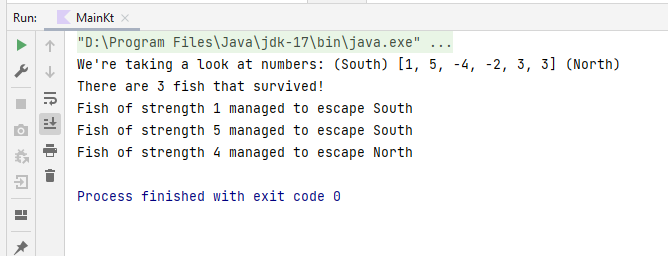

# Interview task of fish eaten by each other on their way to dominate all life

- [Project overview](#project-overview)
- [Requirements](#requirements)
- [Usage](#usage)
  - [Usage from command line](#usage-from-command-line)
  - [Usage from IDE](#usage-from-ide)
  - [Usage from docker](#usage-from-docker)

## Project overview

Instantiate `Fish` with their `.strength` and `.direction` (enum `North` and `South`),
put them into the `River` and get only the `.survivors()`, that is fish that managed
not to be eaten by their fellow fish.

Additionally, use `app.ui.FishStrengths` to parse integer notation of fish `1`, `5`, `-2`, `3`.

## Requirements

You will need 

- Java 8 (or higher)
- Gradle (local or bundled in IntelliJ)
- JUnit5 (local or installed by gradle)

Or

- Docker to use [`gradle:latest`](https://hub.docker.com/_/gradle) image

## Usage

Use project either from command line or IDE.

### Usage from command line

To run tests run `:test` task of gradle:

```
gradle :test
```


To run application run `:run` task of gradle:

```
gradle :run
```


### Usage from IDE


Run tests from IntelliJ using gradle-bundled JUnit:


Run file `Main.kt` as kotlin file from IntelliJ Idea:



### Usage from docker

#### Clone repo

```
git clone git@github.com:Danon/Fish.git
cd Fish/
```

#### Run application

Using PowerShell

```ps
docker run --rm -v "$((pwd).Path):/home/gradle" gradle:latest gradle :run
docker run --rm -v "$((pwd).Path):/home/gradle" gradle:latest gradle :test
```

Using bash

```sh
docker run --rm -v "$PWD":/home/gradle gradle:latest gradle :run
docker run --rm -v "$PWD":/home/gradle gradle:latest gradle :test
```

Image `gradle-alpine:latest` also works.


